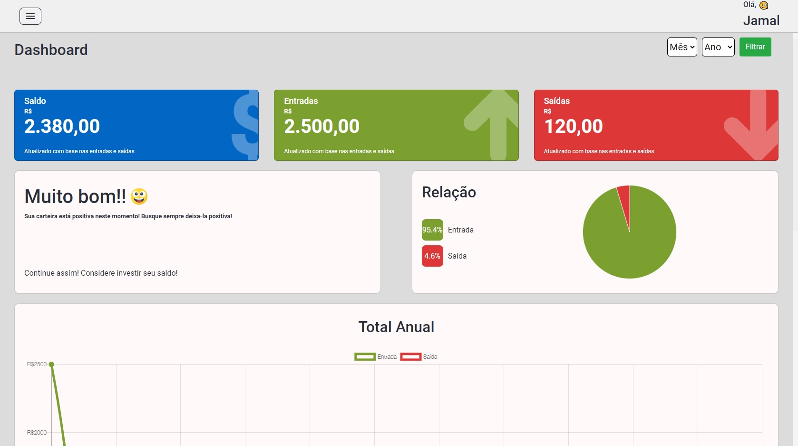
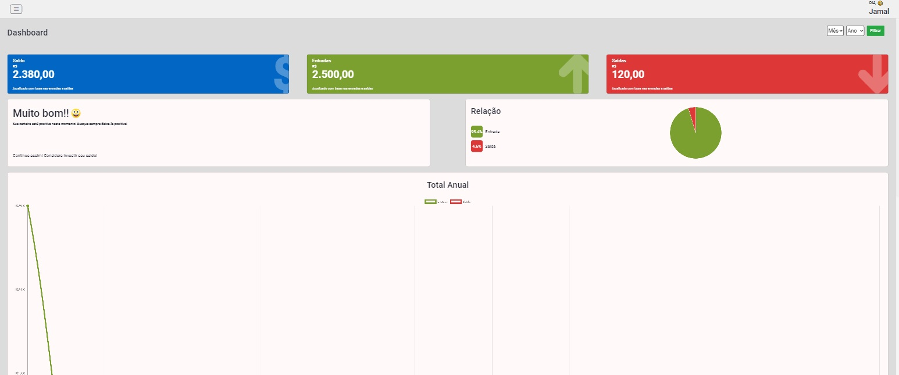
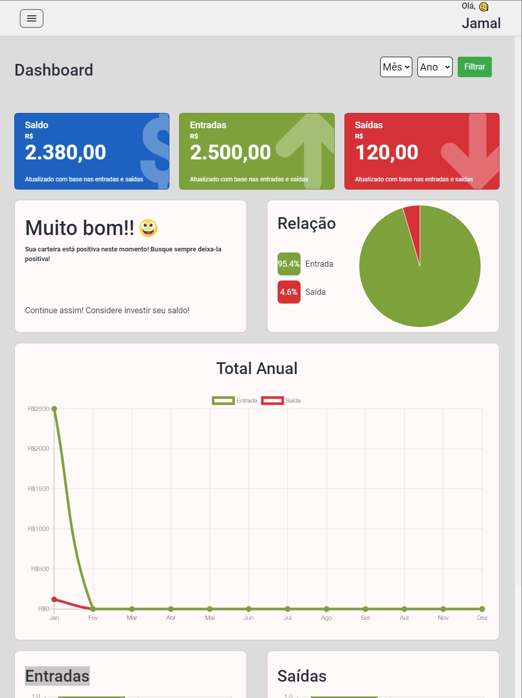
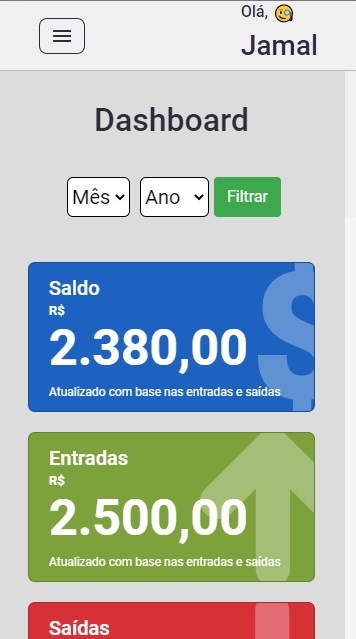

  

 <a href="#eye_speech_bubble-visualizar">Visualizar</a> •
 <a href="#information_source-sobre">Sobre</a> •
 <a href="#boy-autor">Autor</a> •
 <a href="#balance_scale-licença">Licença</a>

---
## :eye_speech_bubble: **Visualizar**

### :desktop_computer: Computador
  
|Desktop|Ultra Wide|
|:---:|:---:|
|<kbd></kbd>|<kbd></kbd>|

### :iphone: Responsividade

|Tablet|Mobile|
|:---:|:---:|
|<kbd></kbd>|<kbd></kbd>

  
---
## :information_source: Sobre

Este projeto já foi desenvolvido antes por mim em react, então resolvi desenvolve-lo em PHP, gostei e quis colocar também um back-end, banco de dados e colocá-lo para funcionar
normalmente com qualquer um podendo usar (<a href="carteira-virtual.com">Site do projeto</a>). É uma carteira virtual, podendo então cadastrar entradas e saídas dos ganhos e compras, dessa forma obtendo um bom controle da economia.

> ⚠️ O servidor de desenvolvimento foi iniciado: localmente em <http://localhost/NOME_DA_PASTA> e posteriormente colocado em uma hospedagem.

Qualquer um que fizer o download, poderá executar o projeto localmente.

OBS: não estou disponibilizando o banco de dados nos download. Toda a amostra é somente para ver os códigos do projeto. 
O projeto pode ser acessado no site: <a href="carteira-virtual.com">Carteira Virtual</a>

---
## :boy: **Autor**

<a href="https://github.com/Jamallc">
 
  
 <b>Weber Rocha</b>
</a>

Desenvolvido com ❤️ por Weber Rocha 👋🏽 Entre em contato!

---
## :balance_scale: **Licença**

Copyright © 2021 [Weber Rocha](https://github.com/Jamallc). 

